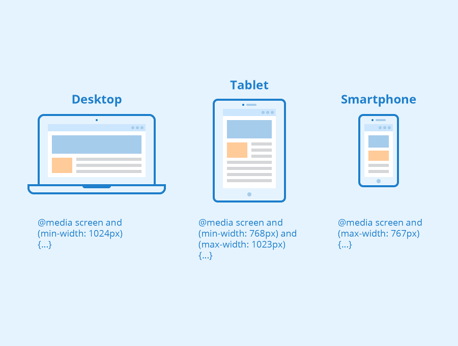

# Media Queries in CSS (Responsive Design)


Media Queries allow CSS to apply different styles depending on the device or screen size.
They are the core technology behind responsive websites.

Example problem:
A layout looks good on a laptop, but on a phone everything becomes too small.
Media queries solve this by saying:

- “If the screen width is small, use different CSS.”

1. Basic Media Query Syntax

The general structure is:
```css
@media (condition) {
  CSS rules here
}

/* Example: */

@media (max-width: 768px) {
  body {
    background: lightblue;
  }
}
```
Meaning:

- If screen width ≤ 768px
- apply this CSS

2. The Most Common Condition: Width

Developers usually check the screen width.
- max-width
Applies styles below a size.
```css
@media (max-width: 600px) {
  body {
    background: yellow;
  }
}
```
Meaning:
- 0px → 600px

Phones usually fall in this range.
- min-width

Applies styles above a size.
```css
@media (min-width: 600px) {
  body {
    background: green;
  }
}
```
Meaning:
- 600px and larger

3. Breakpoints (Very Important)
- Breakpoints are screen sizes where layout changes.

Common modern breakpoints:

- 320px  → small phones
- 480px  → phones
- 768px  → tablets
- 1024px → small laptops
- 1280px → desktops
- 1536px → large screens

Example:
```css
@media (max-width: 768px) {
  .menu {
    display: none;
  }
}
```
Meaning:

Hide menu on tablets and phones
4. Example: Responsive Layout

HTML
```html
<div class="container">
  <div class="box">1</div>
  <div class="box">2</div>
  <div class="box">3</div>
</div>
```
CSS
```css
.container {
  display: flex;
}

.box {
  flex: 1;
}
```
Desktop result:

[1] [2] [3]

Now add media query:
```css
@media (max-width: 600px) {
  .container {
    flex-direction: column;
  }
}
```
Phone result:

[1]
[2]
[3]

This is responsive design.

5. Multiple Media Queries

You can combine multiple screen rules.

Example:
```css
/* phones */
@media (max-width: 600px) {
  body {
    background: pink;
  }
}

/* tablets */
@media (max-width: 900px) {
  body {
    background: orange;
  }
}

/* desktops */
@media (min-width: 901px) {
  body {
    background: blue;
  }
}
```

6. Mobile-First Approach (Modern Method)

Professional developers write CSS starting from mobile.

Example:
```css
.container {
  flex-direction: column;
}
```
Then adjust for larger screens.
```css
@media (min-width: 768px) {
  .container {
    flex-direction: row;
  }
}
```
This is called Mobile-First Design.

Most frameworks use it.

Examples:
- Tailwind
- Bootstrap
- Material UI

